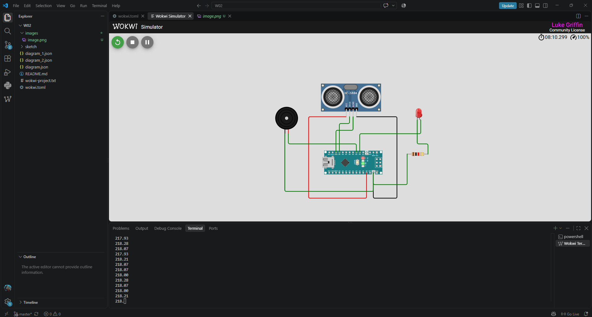
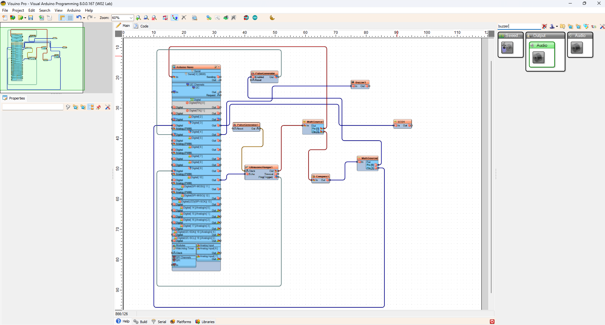

# W02 – Ultrasonic Distance Sensor (Visuino + Wokwi)

**Module:** ET4047
**Author:** Luke Griffin

This project uses an **Arduino Nano** and an **HC-SR04 ultrasonic distance sensor**
to measure distance and drive an **LED** and a **buzzer** in response. The logic
is built visually in **Visuino** (no hand-written firmware) and simulated in
**Wokwi**.

---

## Overview

The ultrasonic sensor continuously measures the distance to the nearest object.
The measured distance is streamed over the serial port and compared against a
threshold; when an object comes within range, the LED and buzzer are activated.

Live distance readings are printed to the serial monitor at **9600 baud**
(e.g. `218.00`, `218.28`, `217.93` … in cm).

## Hardware

| Component | Description |
|-----------|-------------|
| Arduino Nano | Microcontroller board |
| HC-SR04 | Ultrasonic distance sensor (TRIG / ECHO) |
| Piezo Buzzer | Audible alert |
| LED (red) | Visual alert |
| Resistor | Current-limiting resistor for the LED (~220 Ω) |
| Jumper wires | Connections |

## Wokwi Simulation

The circuit wired up and running in the Wokwi simulator:



## Visuino Block Diagram

The visual program that generates the Arduino sketch:



### How the logic works

The Visuino design connects the following blocks:

- **PulseGenerator** blocks provide the timing / clock signals.
- **UltrasonicRanger1** drives the HC-SR04 (`Clock`, `Echo`, `Ping/Trigger`) and
  outputs the measured distance.
- **Compare1** checks the distance against a threshold value.
- **MultiSource** blocks fan the resulting signal out to the outputs.
- **Buzzer1** and **LED1** are activated based on the comparison result.
- The Arduino Nano's **Serial** output prints the live distance readings.

## Project Structure

```
W02/
├── sketch.ino            # Arduino sketch (generated by Visuino)
├── diagram.json          # Wokwi wiring diagram
├── diagram_1.json        # Additional Wokwi diagram variant
├── diagram_2.json        # Additional Wokwi diagram variant
├── wokwi.toml            # Wokwi project configuration
├── wokwi-project.txt      # Wokwi project metadata
├── images/               # README images
└── README.md
```

## Running It

> **Note:** The **online** Wokwi simulator (wokwi.com) does **not** support this
> project. To run it, set up the **Wokwi extension for VS Code** and use this
> repository directly. Follow the official setup guide:
> **https://docs.wokwi.com/vscode/getting-started**

### In Wokwi (VS Code)
1. Set up the Wokwi VS Code extension using the guide linked above.
2. Open this repository in VS Code.
3. Start the simulation.
4. Use the **Distance** slider on the HC-SR04 to change the measured distance.
5. Watch the LED / buzzer respond and the distance print in the terminal.

### On real hardware
1. Open the Visuino project and connect your Arduino Nano.
2. Compile and upload from Visuino (or open the generated `sketch.ino` in the
   Arduino IDE).
3. Wire the HC-SR04, LED (with resistor) and buzzer to match `diagram.json`.
4. Open the serial monitor at 9600 baud to view distance readings.
